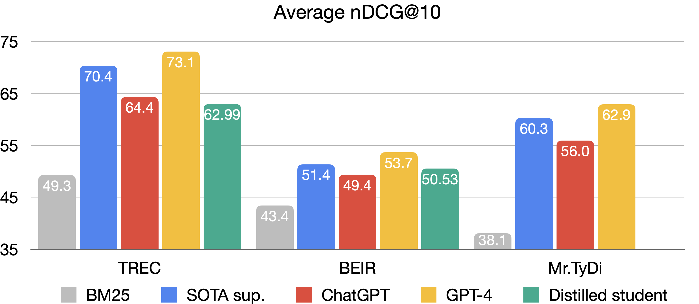

# RankGPT: LLMs as Re-Ranking Agent

This project aims to explore generative LLMs such as ChatGPT and GPT-4 for relevance ranking in Information Retrieval (IR).

We aim to answer the following two questions: 
<ol>
  <li> How does ChatGPT perform on passage re-ranking tasks? </li>
  <li> How to distill the ranking capabilities of ChatGPT to a smaller, specialized model? </li>
</ol>

To answer the first question, we introduce an instructional permutation generation appraoch to instruct LLMs to directly output the permutations of a group of passages.

To answer the second question, we train a cross-encoder using 10K ChatGPT predicted permutations on MS MARCO.

Below are the results (average nDCG@10) of our preliminary experiments on TREC, BEIR and Mr. TyDi.




## New

- **[2023.04.19]** Our paper is now available at https://arxiv.org/abs/2304.09542

## Quick example
Below defines a query and three candidate passages:

```python
item = {
    'query': 'How much impact do masks have on preventing the spread of the COVID-19?',
    'hits': [
        {'content': 'Title: Universal Masking is Urgent in the COVID-19 Pandemic: SEIR and Agent Based Models, Empirical Validation, Policy Recommendations Content: We present two models for the COVID-19 pandemic predicting the impact of universal face mask wearing upon the spread of the SARS-CoV-2 virus--one employing a stochastic dynamic network based compartmental SEIR (susceptible-exposed-infectious-recovered) approach, and the other employing individual ABM (agent-based modelling) Monte Carlo simulation--indicating (1) significant impact under (near) universal masking when at least 80% of a population is wearing masks, versus minimal impact when only 50% or less of the population is wearing masks, and (2) significant impact when universal masking is adopted early, by Day 50 of a regional outbreak, versus minimal impact when universal masking is adopted late. These effects hold even at the lower filtering rates of homemade masks. To validate these theoretical models, we compare their predictions against a new empirical data set we have collected'},
        {'content': 'Title: Masking the general population might attenuate COVID-19 outbreaks Content: The effect of masking the general population on a COVID-19 epidemic is estimated by computer simulation using two separate state-of-the-art web-based softwares, one of them calibrated for the SARS-CoV-2 virus. The questions addressed are these: 1. Can mask use by the general population limit the spread of SARS-CoV-2 in a country? 2. What types of masks exist, and how elaborate must a mask be to be effective against COVID-19? 3. Does the mask have to be applied early in an epidemic? 4. A brief general discussion of masks and some possible future research questions regarding masks and SARS-CoV-2. Results are as follows: (1) The results indicate that any type of mask, even simple home-made ones, may be effective. Masks use seems to have an effect in lowering new patients even the protective effect of each mask (here dubbed"one-mask protection") is'},
        {'content': 'Title: To mask or not to mask: Modeling the potential for face mask use by the general public to curtail the COVID-19 pandemic Content: Face mask use by the general public for limiting the spread of the COVID-19 pandemic is controversial, though increasingly recommended, and the potential of this intervention is not well understood. We develop a compartmental model for assessing the community-wide impact of mask use by the general, asymptomatic public, a portion of which may be asymptomatically infectious. Model simulations, using data relevant to COVID-19 dynamics in the US states of New York and Washington, suggest that broad adoption of even relatively ineffective face masks may meaningfully reduce community transmission of COVID-19 and decrease peak hospitalizations and deaths. Moreover, mask use decreases the effective transmission rate in nearly linear proportion to the product of mask effectiveness (as a fraction of potentially infectious contacts blocked) and coverage rate (as'}
    ]
}

```

We can re-rank the passages using ChatGPT with instructional permutation generation:

```python
from rank_gpt import permutation_pipeline
new_item = permutation_pipeline(item, rank_start=0, rank_end=3, model_name='gpt-3.5-turbo', openai_key='Your OPENAI Key!')
print(new_item)
```

We get the following result:

```python
{
    'query': 'How much impact do masks have on preventing the spread of the COVID-19?',
    'hits': [
        {'content': 'Title: Universal Masking is Urgent in the COVID-19 Pandemic: SEIR and Agent Based Models, Empirical Validation, Policy Recommendations Content: We present two models for the COVID-19 pandemic predicting the impact of universal face mask wearing upon the spread of the SARS-CoV-2 virus--one employing a stochastic dynamic network based compartmental SEIR (susceptible-exposed-infectious-recovered) approach, and the other employing individual ABM (agent-based modelling) Monte Carlo simulation--indicating (1) significant impact under (near) universal masking when at least 80% of a population is wearing masks, versus minimal impact when only 50% or less of the population is wearing masks, and (2) significant impact when universal masking is adopted early, by Day 50 of a regional outbreak, versus minimal impact when universal masking is adopted late. These effects hold even at the lower filtering rates of homemade masks. To validate these theoretical models, we compare their predictions against a new empirical data set we have collected'},
        {'content': 'Title: To mask or not to mask: Modeling the potential for face mask use by the general public to curtail the COVID-19 pandemic Content: Face mask use by the general public for limiting the spread of the COVID-19 pandemic is controversial, though increasingly recommended, and the potential of this intervention is not well understood. We develop a compartmental model for assessing the community-wide impact of mask use by the general, asymptomatic public, a portion of which may be asymptomatically infectious. Model simulations, using data relevant to COVID-19 dynamics in the US states of New York and Washington, suggest that broad adoption of even relatively ineffective face masks may meaningfully reduce community transmission of COVID-19 and decrease peak hospitalizations and deaths. Moreover, mask use decreases the effective transmission rate in nearly linear proportion to the product of mask effectiveness (as a fraction of potentially infectious contacts blocked) and coverage rate (as'},
        {'content': 'Title: Masking the general population might attenuate COVID-19 outbreaks Content: The effect of masking the general population on a COVID-19 epidemic is estimated by computer simulation using two separate state-of-the-art web-based softwares, one of them calibrated for the SARS-CoV-2 virus. The questions addressed are these: 1. Can mask use by the general population limit the spread of SARS-CoV-2 in a country? 2. What types of masks exist, and how elaborate must a mask be to be effective against COVID-19? 3. Does the mask have to be applied early in an epidemic? 4. A brief general discussion of masks and some possible future research questions regarding masks and SARS-CoV-2. Results are as follows: (1) The results indicate that any type of mask, even simple home-made ones, may be effective. Masks use seems to have an effect in lowering new patients even the protective effect of each mask (here dubbed"one-mask protection") is'}
    ]
}
```

<details>
<summary>Step by step example</summary>
  
  ```python
  from rank_gpt import create_permutation_instruction, run_llm, receive_permutation
  
  # (1) Create permutation generation instruction
  messages = create_permutation_instruction(item=item, rank_start=0, rank_end=3, model_name='gpt-3.5-turbo')
  # (2) Get ChatGPT predicted permutation
  permutation = run_llm(messages, openai_key="Your OPENAI Key!", model_name=model_name='gpt-3.5-turbo')
  # (3) Use permutation to re-rank the passage
  item = receive_permutation(item, permutation, rank_start=0, rank_end=3)
  
  ```
  
</details>

## Sliding windows

We introduce a sliding windows strategy that enables the permutation generation instructed LLMs to rank more passages than than their maximum token limit.
The idea is to rank from back to front using a sliding window, re-ranking only the passages within the window at a time.
Below is an example by re-ranking 3 passages with window size of 2 and step size of 1:
```python
from rank_gpt import sliding_windows
new_item = sliding_windows(item, rank_start=0, rank_end=3, window_size=2, step=1, model_name='gpt-3.5-turbo', openai_key='Your OPENAI Key!')
print(new_item)
```


## Cite

```latex
@article{sun2023chatgpt4search,
  title={Is ChatGPT Good at Search? Investigating Large Language Models as Re-Ranking Agent},
  author={Sun Weiwei and Yan, Lingyong and Ma, Xinyu and Ren, Pengjie and Yin, Dawei Yin and Ren, Zhaochun}
  journal={arXiv preprint arXiv:2304.09542},
  year={2023}
}
```
